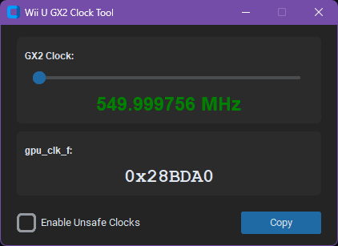

# WiiUGX2ClockTool

A python GUI to calculate the gpu_clk_f value for overclocking the Wii U GX2 using de_fuse.

# Notes
Requires Custom TKinter to be installed.

Windows:

    pip install customtkinter

Linux:

You're on your own, too many different methods depending on Distro.

macOS:

* Install Homebrew

* Install python3 and python-tk

      brew install python python-tk

* Setup a venv for python
      
      python3 -m venv /Users/[USERNAME]/.local/python/venvs
      source /Users/[USERNAME]/.local/python/venvs/bin/activate
      python3 -m pip install customtkinter

It's incredibly simple and my first python app, go easy on me.

# Warning
I am not responsible for any damage caused by using this tool.
